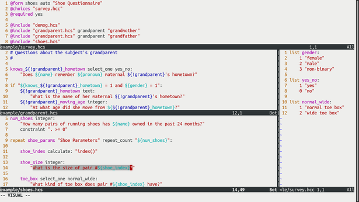

# Honeybee: tools for efficient editing of XLSForm questionnaires

[XLSForm questionnaires](http://xlsform.org/en/) are a staple of survey data collection.
The main way to edit them is either through SurveyCTO's online form builder, or in Excel documents.
The problem is that as questionnaires get longer, or if they contain repetitions of similar questions, edits become both more prone to mistakes and more labor-intensive.

Honeybee is a prototyped set of tools to solve this problem.
It implements a domain-specific language called Honeycomb.
The tools include:

- `beepile`: a compiler for the Honeycomb language into XLSForm questionnaires formatted as Excel documents
- `beelint`: a program to check the correctness of Excel documents
- syntax highlighting in the [Vim](https://en.wikipedia.org/wiki/Vim_(text_editor)) text editor

## Installation

### Honeybee

Honeybee has been tested with Python 3.8.
Required packages:

- [argh](https://github.com/neithere/argh)
- [pyparsing](https://github.com/pyparsing/pyparsing)
- [openpyxl](https://openpyxl.readthedocs.io/en/stable/)

### Syntax highlighting in Vim



## The Honeycomb language

Honeybee allows us to work with questionnaires in a language called Honeycomb.
Honeycomb is designed to be easy to read and change.
This document is an introduction to the syntax through a series of examples.

### The `@form` command

The form ID, form version, and form title are set with the `@form` command.
For example:

```
@form shoes 1 "Shoe Questionnaire"
```

To save us the trouble of automatically augmenting the version number every time we make an edit, we can use the `auto` keyword:

```
@form shoes auto "Shoe Questionnaire"
```

For `auto`, Honeybee generates a ten-digit version number based on the current time using two-digit year + month + day + hour + minute as its format.
For the time zone, it uses UTC.

### Comments

Any line that starts with a hashmark is interpreted as a comment:

```
# TODO Write the questionnaire.
```

### Questions

To create a question that takes the name of the subject as free text, we can say the following in Honeycomb:

```
name text: "What is the name of the subject?"
```

This gets translated into XLSForm as:

| type | name | label |
| -- | -- | -- |
| text | name | What is the name of the subject? |

Questions can be broken into multiple lines at the colon.
This means that the following is equivalent:

```
name text:
    "What is the name of the subject?"
```

### Question parameters

We might want to make the `name` question required.
We can do this by adding `required yes` after the label:

```
name text:
    "What is the name of the subject?"
    required yes
```

In XLSForm, this adds a new column:

| type | name | label | required |
| -- | -- | -- | -- |
| text | name | What is the name of the subject? | yes |

Any other parameter known to XLSForm can be added this way.
For example, let's ask about the subject's age in years:

```
age integer:
    "What is the age of the subject?"
```

As `age` is an integer field, it allows the answer to be zero or a negative number.
It is a good idea to add a constraint to avoid this:

```
age integer:
    "What is the age of the subject?"
    constraint ". > 0"
    constraint_message "Age must be a positive integer."
```

In XLSForm, this shows up as we would expect:

| type | name | label | constraint | constraint\_message |
| -- | -- | -- | -- | -- |
| integer | age | What is the age of the subject? | . > 0 | Age must be a positive integer. |

### Variable substitution

In a questionnaire, we might ask for both the name and the age of the subject.
Once we ask for the name, we can use the answer in subsequent questions:

```
name text:
    "What is the name of the subject?"
    required yes

age integer:
    "What is ${name}'s age?"
    required yes
    constraint ". > 0"
    constraint_message "Age must be a positive integer."
```

This translates into XLSForm as:

| type | name | label | required | constraint | constraint\_message |
| -- | -- | -- | -- | -- | -- |
| text | name | What is the name of the subject? | yes | | |
| integer | age | What is ${name}'s age? | yes | . > 0 | Age must be a positive integer. |

### Setting `required yes` as the default

We might well want to make every question required in the questionnaire.
We can do this by issuing `@required yes`:

```
@required yes

name text:
    "What is the name of the subject?"

age integer:
    "What is ${name}'s age?"
    constraint ". > 0"
    constraint_message "Age must be a positive integer."
```

This results in the same output in XLSForm.

Note that `@required yes` applies to every subsequent question.
Sometimes, we don't want a question to be required.
For example, if we make a `note` type question required, the questionnaire will refuse to move to the next question.
In such cases, if we have issued `@required yes`, we need to explicitly specify `required no` for the relevant questions:

```
@required yes

name text:
    "What is the name of the subject?"

welcome_note note:
    "Pleased to meet you, ${name}!"
    required no

age integer:
    "What is ${name}'s age?"
    constraint ". > 0"
    constraint_message "Age must be a positive integer."
```

In XLSForm:

| type | name | label | required | constraint | constraint\_message |
| -- | -- | -- | -- | -- | -- |
| text | name | What is the name of the subject? | yes | | |
| note | welcome\_note | Pleased to meet you, ${name}! | no | | |
| integer | age | What is ${name}'s age? | yes | . > 0 | Age must be a positive integer. |

### Choice lists

Single-choice and multiple-choice questions are useful ways of controlling answers to non-numeric questions.
In XLSForm, these are specified by the `select_one` and the `select_multiple` question types.
Both of these question types reference choice lists.
In Honeycomb, choice lists are linked to the survey with the `@choices` keyword.
For example, in our main survey file, `survey.hcs`, we might have:

```
@choices "survey.hcc"

gender select_one gender:
    "What is ${name}'s gender?"
```

In the file called `survey.hcc`, we can write:

```
list gender:
    1 "female"
    2 "male"
    3 "non-binary"
```

### Automatic computations with `calculate`

"Questions" of the `calculate` type are useful for dynamic computations, for example to derive information from previous answers.
Suppose that we want to know where the subject's maternal grandmother is originally from.
We can use the answer to the gender question to construct the appropriate pronoun for our hometown question.
In `survey.hcs`:

```
@choices "survey.hcc"

gender select_one gender:
    "What is ${name}'s gender?"

pronoun calculate:
    "if(${gender} = 1, 'her', if(${gender} = 2, 'his', 'their'))"

knows_grandmother_hometown select_one yes_no:
    "Does ${name} remember ${pronoun} maternal grandmother's hometown?"
```

In XLSForm, these questions are represented as:

| type | name | label | calculation |
| -- | -- | -- | -- |
| select\_one gender | gender | What is \${name}'s gender? | |
| calculate | pronoun | | if(\${gender} = 1, 'her', if(${gender} = 2, 'his', 'their')) |
| select\_one yes\_no | knows\_hometown | Does ${name} remember ${pronoun} maternal grandmother's hometown? | |

In `survey.hcc`, we can specify both the `gender` and the `yes_no` choice lists:

```
list gender:
    1 "female"
    2 "male"
    3 "non-binary"

list yes_no:
    1 "yes"
    0 "no"
```

This example uses a nested `if()` call in the `calculate` expression.
The complete set of operators and functions that SurveyCTO supports is described in the documentation on <https://docs.surveycto.com/02-designing-forms/01-core-concepts/09.expressions.html>.

### The `if` statement

Honeycomb lets us visually indicate "skip patterns," that is, when a question is only asked if a certain condition is satisfied.
We might want to ask what the subject's maternal grandmother's hometown is, but only if the subject knows:

```
knows_grandmother_hometown select_one yes_no:
    "Does ${name} remember ${pronoun} maternal grandmother's hometown?"

if ${knows_grandmother_hometown} = 1:
    grandmother_hometown text:
        "What is the name of ${pronoun} maternal grandmother's hometown?"
```

In XLSForm, the `if` condition is translated into a `relevance` condition:

| type | name | label | relevance |
| -- | -- | -- | -- |
| select\_one yes\_no | knows\_hometown | Does ${name} remember ${pronoun} maternal grandmother's hometown? | |
| text | grandmother\_hometown | What is the name of ${pronoun} maternal grandmother's hometown? | ${knows\_hometown} = 1 |

For function calls and compound expressions in the `if` condition, Honeybee currently only supports specifying these in a string.
For example, the above condition can also be written with the `selected()` function:

```
if "selected(${knows_grandmother_hometown}, '1')":
    grandmother_hometown text:
        "What is the name of ${pronoun} maternal grandmother's hometown?"
```

Or if we only want to ask the question if the subject is female:

```
if "${knows_grandmother_hometown} = 1 and ${gender} = 1":
    grandmother_hometown text:
        "What is the name of her maternal grandmother's hometown?"
```

Finally, we can add multiple questions in an `if` block:

```
if "${knows_grandmother_hometown} = 1 and ${gender} = 1":
    grandmother_hometown text:
        "What is the name of her maternal grandmother's hometown?"
    grandmother_moving_age integer:
        "At what age did she move from ${grandmother_hometown}?"
```

In XLSForm, this sets the same `relevance` condition for both questions:

| type | name | label | relevance |
| -- | -- | -- | -- |
| text | grandmother\_hometown | What is the name of her maternal grandmother's hometown? | ${knows\_hometown} = 1 and ${gender} = 1 |
| integer | grandmother\_moving\_age | At what age did she move from ${grandmother\_hometown}? | ${knows\_hometown} = 1 and ${gender} = 1 |

### Groups and repeat groups

Questions can be organized into groups.
This is useful, for example, if we want SurveyCTO to display multiple questions on the same screen.
In XLSForm, this is specified by setting the `appearance` parameter to `field-list`:

```
group shoe_params "Shoe Parameters" appearance "field-list":

    shoe_size integer:
        "What is ${name}'s shoe size?"

    toe_box select_one normal_wide:
        "What kind of toe box do ${name}'s shoes have?"
```

In XLSForm, this becomes:

| type | name | label | appearance |
| -- | -- | -- | -- |
| begin group | shoe\_params | Shoe Parameters | field-list |
| integer | shoe\_size | What is ${name}'s shoe size? | |
| select\_one normal\_wide | toe\_box | What kind of toe box do ${name}'s shoes have? | |
| end group | shoe\_params | | |

Repeat groups are specified similarly, e.g.:

```
num_shoes integer:
    "How many pairs of running shoes has ${name} owned in the past 24 months?"
    constraint ". >= 0"

repeat shoe_params "Shoe Parameters" repeat_count "${num_shoes}":

    shoe_index calculate: "index()"

    shoe_size integer:
        "What is the size of pair #${shoe_index}?"

    toe_box select_one normal_wide:
        "What kind of toe box does pair #${shoe_index} have?"
```

### The `@include` command

For long questionnaires, we might want to split the survey into multiple files for better structure.
We can do this with the `@include` command.

We might want to separate the demographic questions in our questionnaire from the questions about the subject's grandmother and shoes.
In `survey.hcs`, we might write:

```
@form shoes auto "Shoe Questionnaire"
@choices "survey.hcc"
@required yes

@include "demog.hcs"
@include "grandmother.hcs"
@include "shoes.hcs"
```

In `demog.hcs`:

```
#
# Demographic questions
#

name text:
    "What is the name of the subject?"

welcome_note note:
    "Pleased to meet you, ${name}!"
    required no

age integer:
    "What is ${name}'s age?"
    constraint ". > 0"
    constraint_message "Age must be a positive integer."

gender select_one gender:
    "What is ${name}'s gender?"

pronoun calculate:
    "if(${gender} = 1, 'her', if(${gender} = 2, 'his', 'their'))"
```

In `grandmother.hcs`:

```
#
# Questions about the subject's grandmother
#

knows_grandmother_hometown select_one yes_no:
    "Does ${name} remember ${pronoun} maternal grandmother's hometown?"

if "${knows_grandmother_hometown} = 1 and ${gender} = 1":
    grandmother_hometown text:
        "What is the name of her maternal grandmother's hometown?"
    grandmother_moving_age integer:
        "At what age did she move from ${grandmother_hometown}?"
```

And in `shoes.hcs`:

```
#
# Questions about shoes
#

num_shoes integer:
    "How many pairs of running shoes has ${name} owned in the past 24 months?"
    constraint ". >= 0"

repeat shoe_params "Shoe Parameters" repeat_count "${num_shoes}":

    shoe_index calculate: "index()"

    shoe_size integer:
        "What is the size of pair #${shoe_index}?"

    toe_box select_one normal_wide:
        "What kind of toe box does pair #${shoe_index} have?"
```

### Re-using questions with the `@include` command

The `@include` command also supports parameters.
In Honeycomb, these parameters are used for macro substitution.

For example, we can change `grandmother.hcs` to reference either maternal grandparent rather than specifically the grandmother.
We can call this file `grandparent.hcs`:

```
knows_${!grandparent}_hometown select_one yes_no:
    "Does ${name} remember ${pronoun} maternal ${!grandparent}'s hometown?"

if "${knows_${!grandparent}_hometown} = 1 and ${gender} = 1":
    ${!grandparent}_hometown text:
        "What is the name of her maternal ${!grandparent}'s hometown?"
    ${!grandparent}_moving_age integer:
        "At what age did she move from ${${!grandparent}_hometown}?"
```

And in `survey.hcs`, we might write:

```
@include "grandparent.hcs" grandparent "grandmother"
```

The best use of `@include` macros is in enforcing the ["don't repeat yourself" (DRY) principle](https://en.wikipedia.org/wiki/Don%27t_repeat_yourself).
We might have a series of questions that we want to repeat in various parts of the questionnaire.
In XLSForm, these questions need to be manually added each time.
In Honeycomb, we can isolate these questions to define them only once, and use the `@include` command each time we need them.

We can, for example, ask about _both_ grandparents in the survey:

```
@include "grandparent.hcs" grandparent "grandmother"
@include "grandparent.hcs" grandparent "grandfather"
```

The major benefit of structuring the questionnaire this way is that if we want to change or delete a grandparent question or add a new one, we only have to do it in one place.
This saves effort and reduces the chance for error.

